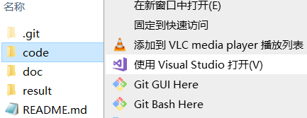

# Fluid Simulation System

# 环境配置

- 操作系统: `Windows 10`
- 编译器：`MSVC(Visual Studio 2022)`
- `Opengl 3.3` 以上
- `CMake 3.8` 以上

# 编译说明

1.  右键`./code`文件夹->使用`Visual Studio`打开

2.  项目->配置缓存

3.  生成->全部重新生成

4.  选择启动项

# UI 说明

- 系统初次运行后，拖动窗口，设置窗口位置，例：

  

- 我们可以选择各种模拟方法。系统中共有二维和三维场景下、拉格朗日描述与欧拉描述的共四种模拟方法。（当你刚运行代码，点击 Continue 后粒子块/网格也并不会变化，如何让它像流体一样动起来，这就是同学们要完成的求解工作）

  

# 如何编写流体求解器

- 本系统的渲染代码（Renderer）、粒子系统（Particle System）与网格系统（MAC grid）均已实现。同学们需要做的是如何在已有粒子系统或网格系统的基础上，实现相应的求解器（Solver）。

- 使用 visual studio 打开 code 文件夹后我们可以看到 fluid2d，fluid3d 文件夹。其中分别有拉格朗日描述、欧拉描述的流体求解代码。同学们需要实现 Solver 类的编写，简单来说，系统每渲染一帧都会调用 Solver::solve()函数，在此函数中计算流体经过 dt 时间后的各种状态即为主要任务。

# 模拟结果示例

- 项目中提供了可直接运行的示例：`./exe/FluidSimulationSystem.exe`。同学们可以尝试运行它，调节各种参数，观察流体的运动。

- 由于网格法的计算量会比粒子法大，难以达到实时交互（其实是因为本人能力有限）。同学们亦可以查看 `./result` 中加速后的视频。

# 其他

1. [补充说明(intro.md)](./doc/intro.md)

2. 该系统旨在为缺乏图形学编程基础的同学提供帮助，使他们无需花费时间在配置环境、搭建 UI、学习 OpenGL 等工作，能够专注于流体求解代码的编写。如果同学已经具备相关的基础知识，亦可独立完成任务。

3. 由于本人能力与时间有限，现阶段系统仍相对简陋，还有很多不足之处，望同学们批评指正，提出宝贵建议。
