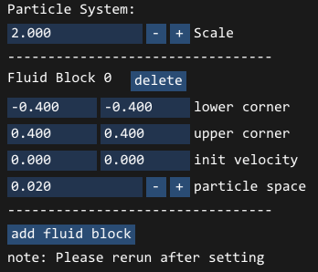
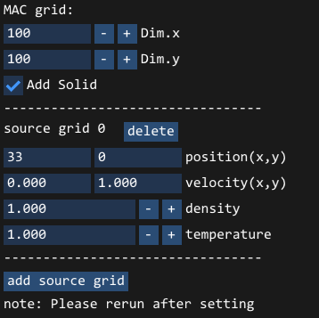

# 补充说明

# 文件目录

```bash
---- code
  |- common         # 通用工具，Camera、Component、Shader等
  |- fluid2d        # 二维流体模拟
     |- Eulerian        # 欧拉描述
     |- Lagrangian      # 拉格朗日描述
  |- fluid3d        # 三维流体模拟
     |- Eulerian        # 欧拉描述
     |- Lagrangian      # 拉格朗日描述
  |- third_party    # 第三方库, boost, glfw, glm, imgui, stb_image, glad等
  |- resources      # shader代码等
  |- ui        # imgui搭建的ui系统
```

# 参数说明

如果你已经成功运行了`./exe/FluidSimulationSystem.exe`，你会发现每一种模拟方法均有很多参数供我们调节。实际上该系统的参数确实繁多，这些重要的参数均放在`./code/common/src/Configure.cpp`中定义。虽然代码中有一些注释，但这里我将根据 UI，对二维场景下的参数稍作讲解，三维则与之类似：

### Lagrangian 2d



1. 2 维的拉格朗日描述下，我们的容器默认为以(-1, -1)和(1, 1)为对角线的正方形。因此我们添加的流体块（Fluid Block）也应在其范围内。

2. 我们同样以左下角、右上角来描述流体块的大小与位置，也可以给流体赋予一个初速度。粒子间隔（particle space）为该流体块内生成的粒子的间隔，该值决定了流体块内粒子的多少。我们可以删除，也可以添加流体块。

3. `scale`参数将整个系统（包含容器与流体块）的各个维度进行缩放。如果你不愿意改变流体块，仍想控制系统中粒子的个数，直接调节`scale`是比较快的选择。

4. 值得注意的是，上述参数均是对粒子系统本身进行设置，因此不能作用于已经初始化的粒子系统，需要点击 rerun 才能应用新设置的参数。


5. 这是流体求解中用到的一些物理参数，你可以实时地调节它，观察流体的变化。


6. 这些是求解器需要用到的参数，包含 dt，子步数，粒子碰到边界的衰减系数，粒子的最大速度。

### Eulerian 2d



1. 类似地，我们能够控制网格的维度。以及空间中是否含有其他固体（示例中为一块木板）。

2. 与流体块类似，这里我们可以设置释放流体（烟雾）的网格，包含位置、初速度、密度、温度。


3. 这些参数与前文类似，这里不再赘述。

# 粒子系统 & 网格系统（重要）

项目中每一个模拟方法都有 4 个类

1. Particle System / MAC grid: 用来描述流体
2. Renderer: 根据粒子、或网格的信息来渲染流体
3. Solver: 求解 dt 时间内流体的变化
4. Component: 组织流体、渲染器、求解器完成模拟任务，将模拟结果返回给 UI。

为了求解流体，我们首先要了解流体是如何被描述的。

#### 拉格朗日描述下

```cpp
// 单个粒子的信息
struct ParticleInfo2d
{
    alignas(8) glm::vec2 position;
    alignas(8) glm::vec2 velocity;
    alignas(8) glm::vec2 accleration;
    alignas(4) float density;
    alignas(4) float pressure;
    alignas(4) float pressDivDens2;
    alignas(4) uint32_t blockId;
};

class ParticleSystem2d
{
public:
    ParticleSystem2d();
    ~ParticleSystem2d();

    void setContainerSize(glm::vec2 containerCorner, glm::vec2 containerSize);
    int32_t addFluidBlock(glm::vec2 corner, glm::vec2 size, glm::vec2 v0, float particleSpace);
    uint32_t getBlockIdByPosition(glm::vec2 position);
    void updateBlockInfo();

public:
    // 粒子参数
    float supportRadius = Lagrangian2dPara::supportRadius;
    float supportRadius2 = supportRadius * supportRadius;
    float particleRadius = Lagrangian2dPara::particleRadius;
    float particleDiameter = Lagrangian2dPara::particleDiameter;
    float particleVolume = particleDiameter * particleDiameter;

    // 存储全部粒子信息
    std::vector<ParticleInfo2d> particles;

    // 容器参数
    glm::vec2 lowerBound = glm::vec2(FLT_MAX);
    glm::vec2 upperBound = glm::vec2(-FLT_MAX);
    glm::vec2 containerCenter = glm::vec2(0.0f);

    // Block结构（加速临近搜索）
    glm::uvec2 blockNum = glm::uvec2(0);
    glm::vec2 blockSize = glm::vec2(0.0f);
    std::vector<glm::uvec2> blockExtens;
    std::vector<int32_t> blockIdOffs;
};
```

这些代码不难理解，其中值得注意的是 Block 结构。我们在求解会用到 Block 结构将容器划分成多个 Block，当我们要查询某个粒子的相邻粒子时，可以直接在相邻的 Block 里进行查找，从而节约时间。其相关成员变量的含义为：

- blockIdOffs: 存储着当前 block 与相邻的 9 个 block 的索引之差。
- blockExtens: 每一个 block 对应着一个区间(a, b)。blockExtens[i] = (a, b)表示，particles[a]到 particles[b]的粒子均处于第 i 个 block 中（要确保粒子已根据 blockId 排序）。

#### 欧拉描述下

```cpp
class MACGrid2d
{
public:
    MACGrid2d();
    ~MACGrid2d();
    MACGrid2d(const MACGrid2d &orig);
    MACGrid2d &operator=(const MACGrid2d &orig);

    void reset();

    glm::vec4 getRenderColor(int i, int j);
    glm::vec4 getRenderColor(const glm::vec2 &pt);

    // Setup
    void initialize();
    void createSolids();
    void updateSources();

    // advect
    glm::vec2 semiLagrangian(const glm::vec2 &pt, double dt);

    // get value
    glm::vec2 getVelocity(const glm::vec2 &pt);
    double getVelocityX(const glm::vec2 &pt);
    double getVelocityY(const glm::vec2 &pt);
    double getTemperature(const glm::vec2 &pt);
    double getDensity(const glm::vec2 &pt);

    enum Direction
    {
        X,
        Y
    };

    // get point
    glm::vec2 getCenter(int i, int j);
    glm::vec2 getLeft(int i, int j);
    glm::vec2 getRight(int i, int j);
    glm::vec2 getTop(int i, int j);
    glm::vec2 getBottom(int i, int j);

    void getCell(int index, int &i, int &j);
    int getIndex(int i, int j);
    bool isNeighbor(int i0, int j0, int i1, int j1);
    bool isValid(int i, int j, Direction d);

    int isSolidCell(int i, int j);
    int isSolidFace(int i, int j, Direction d);

    bool inSolid(const glm::vec2 &pt);
    bool inSolid(const glm::vec2 &pt, int &i, int &j);

    bool intersects(const glm::vec2 &pt, const glm::vec2 &dir, int i, int j, double &time);
    int numSolidCells();

    // 计算两个网格单元之间的压力系数
    double getPressureCoeffBetweenCells(int i0, int j0, int i1, int j1);

    // 计算散度
    double getDivergence(int i, int j);
    // 检查散度
    double checkDivergence(int i, int j);
    bool checkDivergence();

    // 计算Boussinesq Force
    double getBoussinesqForce(const glm::vec2 &pt);

    float cellSize;
    int dim[2];

    Glb::GridData2dX mU;        // x velocity
    Glb::GridData2dY mV;        // y velocity
    Glb::CubicGridData2d mD;    // density
    Glb::CubicGridData2d mT;    // temperature

    Glb::GridData2d mSolid;     // solid
};
```

相较于粒子系统，这里的代码略微复杂。简单地来说，我们使用交错网格的结构，将各个属性存储起来。其中速度存储在边上，而密度、温度则存储在网格的中点。（若不了解，可以搜索 staggered grid 加以学习）

#### 综上，拉格朗日描述下，同学们需要实现的可能有：

1. 计算密度与压强
2. 计算加速度
3. 更新速度与位置
4. 检查边界情况
5. 更新 Block 信息
6. ...

#### 欧拉描述下，同学们需要实现的可能有：

1. 对流（advect）
2. 计算外部力
3. 投影（project）
4. ...

# 其他

- 拉格朗日描述下，系统将密度为 1000 的粒子渲染为蓝色，并通过粒子颜色的变化来表示密度变化。

- 三维场景下欧拉描述的烟雾，其渲染的结果为切面，当勾选（One-sheet）后，同学们可以通过调节 distance，控制切面距离 X-Y/Y-Z/X-Z 平面的距离。当未勾选（One-sheet）时，将在一个方向渲染多张切面，这样会产生一定的三维效果，但同时开销较大。
